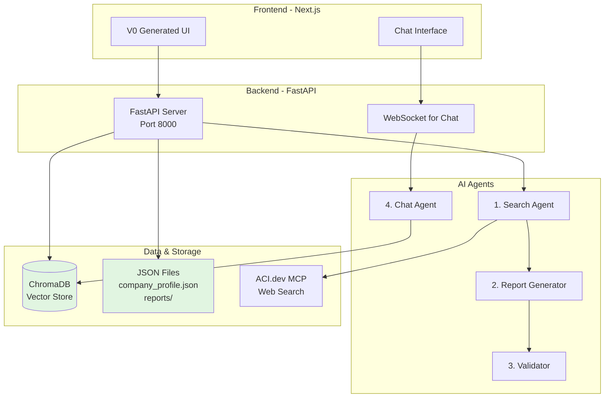

# 🚚 Logistics Compliance App - Simplified Single-User Implementation

## 📋 Project Overview

A lightweight AI-powered desktop application for monitoring legal and regulatory changes in logistics. Designed for a **single user** running locally with **minimal configuration** and **no complex infrastructure**.

### Core Value Proposition
- **Simple Setup**: Run locally with just Python and Node.js - no Docker or complex databases
- **AI-Powered Reports**: Multi-agent system (Search → Generate → Validate) creates accurate compliance reports
- **Interactive Chat**: Ask follow-up questions about your reports in Perplexity-style UI
- **Local Data Storage**: ChromaDB vector database (free tier) + JSON files - everything stays on your machine

---

## 🏗️ Simplified Architecture



### What's Different from Original Spec?
| Original | Simplified |
|----------|------------|
| PostgreSQL + Redis | **ChromaDB** (free, local vector database) |
| Docker Compose | **Direct Python/Node execution** |
| Celery task queue | **Simple Python threading** for background tasks |
| Multi-user authentication | **Single user** (optional simple password) |
| Complex deployment | **Local development** setup only |
| Traditional SQL | **JSON files + vector embeddings** |

### Why ChromaDB?
- ✅ **100% Free** - No paid tiers, unlimited local usage
- ✅ **Zero Config** - Single Python import, auto-creates local storage
- ✅ **Built-in Embeddings** - Automatic vector generation for semantic search
- ✅ **Persistent Storage** - Data stored in `./chroma_data/` folder
- ✅ **Perfect for RAG** - Ideal for chat context retrieval
- ✅ **No Server Needed** - Runs in-process with your FastAPI app

---

## 🎯 Core Features (Simplified)

### 1️⃣ **Company Profile Setup**
- Single JSON file (`data/company_profile.json`) stores your company info
- Edit via UI form or directly in JSON file
- Contains: routes, vehicle types, cargo categories, monitoring preferences

### 2️⃣ **On-Demand Report Generation**
- Click "Generate Report" button in UI
- Search Agent queries ACI.dev MCP servers
- Report Generator creates structured report
- Validator checks quality (3 iterations max)
- Report saved to JSON + ChromaDB (for semantic search)

### 3️⃣ **Report Viewer**
- List all past reports (from JSON files)
- View report details with sections: Summary, Legal Changes, Route Impacts, Recommendations
- Semantic search through all reports
- Export to PDF or JSON

### 4️⃣ **Interactive Chat with RAG**
- Click on any report to open chat interface
- Ask questions about the report
- Chat Agent uses ChromaDB to retrieve relevant context
- Provides answers with source citations
- Conversation history stored in JSON

### 5️⃣ **Manual Scheduling** (Optional)
- Simple Python script runs in background
- Generates report at specified time daily/weekly
- Uses Python `schedule` library (not Celery)

---

## 🛠️ Simplified Technology Stack

### Backend (Python)
```
FastAPI              # API server
anthropic            # Claude SDK for agents
chromadb             # Vector database (FREE, local)
pydantic             # Data validation
httpx                # HTTP requests for MCP
python-jose          # JWT tokens (optional auth)
schedule             # Simple task scheduling
```

### Frontend (JavaScript)
```
Next.js 14           # React framework
Tailwind CSS         # Styling
V0 components        # UI generation
axios                # API calls
```

### No Need For:
- ❌ Docker / Docker Compose
- ❌ Redis
- ❌ PostgreSQL / MySQL
- ❌ Celery
- ❌ Complex deployment configs
- ❌ Paid database services

---

## 📦 Simplified Project Structure

```
logistics-compliance-app/
├── backend/
│   ├── main.py                      # FastAPI app entry
│   ├── config.py                    # Load .env settings
│   ├── vector_db.py                 # ChromaDB setup
│   ├── agents/
│   │   ├── search_agent.py          # Search Agent
│   │   ├── report_agent.py          # Report Generator
│   │   ├── validator_agent.py       # Validator
│   │   └── chat_agent.py            # Chat Agent (RAG)
│   ├── models.py                    # Pydantic models
│   ├── routes.py                    # API endpoints
│   ├── mcp_client.py                # MCP server integration
│   ├── scheduler.py                 # Optional background scheduling
│   ├── requirements.txt             # Python dependencies
│   └── .env                         # API keys
├── frontend/
│   ├── app/
│   │   ├── page.tsx                 # Home/dashboard
│   │   ├── profile/page.tsx         # Company profile editor
│   │   ├── reports/
│   │   │   ├── page.tsx             # Report list
│   │   │   └── [id]/page.tsx        # Report detail + chat
│   ├── components/
│   │   ├── ProfileForm.tsx
│   │   ├── ReportCard.tsx
│   │   ├── ReportViewer.tsx
│   │   └── ChatInterface.tsx
│   ├── lib/
│   │   └── api.ts                   # API client
│   ├── package.json
│   └── .env.local                   # API_URL=http://localhost:8000
├── data/
│   ├── company_profile.json         # Your company profile
│   ├── reports/                     # JSON reports by ID
│   │   ├── report_001.json
│   │   └── report_002.json
│   ├── chat_history/                # Chat conversations
│   │   ├── report_001_chat.json
│   │   └── report_002_chat.json
│   └── chroma_data/                 # ChromaDB persistent storage (auto-created)
├── README.md
└── .env.example
```

---

## 🚀 Quick Start Guide

### Prerequisites
- Python 3.10+
- Node.js 18+
- Anthropic API key
- ACI.dev MCP access

### Setup (5 minutes)

**1. Clone and setup backend:**
```bash
cd backend
python -m venv venv
source venv/bin/activate  # On Windows: venv\Scripts\activate
pip install -r requirements.txt

# Create .env file
echo "ANTHROPIC_API_KEY=your_key_here" > .env

# Initialize ChromaDB and folders (automatic on first run)
python -c "from vector_db import init_vector_db; init_vector_db()"
```

**2. Setup frontend:**
```bash
cd frontend
npm install

# Create .env.local
echo "NEXT_PUBLIC_API_URL=http://localhost:8000" > .env.local
```

**3. Create company profile:**
```bash
mkdir -p data/reports data/chat_history
cp backend/data/company_profile.example.json data/company_profile.json
# Edit data/company_profile.json with your company details
```

**4. Run the app:**
```bash
# Terminal 1 - Backend
cd backend
python main.py
# FastAPI runs on http://localhost:8000

# Terminal 2 - Frontend
cd frontend
npm run dev
# Next.js runs on http://localhost:3000
```

**5. Generate your first report:**
- Open http://localhost:3000
- Go to Profile page, verify/edit your company info
- Click "Generate Report"
- Wait 2-3 minutes for AI agents to work
- View report and start chatting!

---

## 🔧 Implementation Phases (Simplified)

### **Phase 1: Backend Foundation** (Day 1-2)

**✅ Tasks:**
1. Create FastAPI app with basic endpoints
2. Set up ChromaDB for vector storage
3. Implement company profile JSON loader
4. Create MCP client for ACI.dev
5. Test web search functionality

**📁 Files to create:**
- `backend/main.py` - FastAPI app entry
- `backend/vector_db.py` - ChromaDB setup
- `backend/models.py` - Pydantic models
- `backend/mcp_client.py` - MCP integration
- `backend/routes.py` - API endpoints

**🎯 Goal:** Backend runs, can load profile, search web via MCP

---

### **Phase 2: AI Agents** (Day 3-5)

**✅ Tasks:**
1. **Search Agent**: Takes company profile → generates search queries → retrieves data
2. **Report Generator Agent**: Takes search results → creates structured report
3. **Validator Agent**: Reviews report → approves or provides feedback (max 3 iterations)
4. Implement agent orchestration in service layer
5. **Store reports in ChromaDB** with embeddings for semantic search

**📁 Files to create:**
- `backend/agents/search_agent.py`
- `backend/agents/report_agent.py`
- `backend/agents/validator_agent.py`
- `backend/services/report_service.py` - Orchestrates agents

**🎯 Goal:** Click API endpoint → full validated report generated and stored

---

### **Phase 3: Frontend** (Day 6-8)

**✅ Tasks:**
1. Use V0 to generate UI components
2. Create company profile form
3. Build report list view with search
4. Implement report detail viewer
5. Add "Generate Report" button

**📁 Files to create:**
- `frontend/app/page.tsx` - Dashboard
- `frontend/app/profile/page.tsx` - Profile editor
- `frontend/app/reports/page.tsx` - Report list
- `frontend/app/reports/[id]/page.tsx` - Report detail
- `frontend/components/*` - V0 generated components

**🎯 Goal:** Full UI workflow from profile setup to viewing reports

---

### **Phase 4: Chat Feature with RAG** (Day 9-10)

**✅ Tasks:**
1. Implement WebSocket endpoint in FastAPI
2. Create Chat Agent with ChromaDB RAG
3. Build chat UI component (Perplexity-style)
4. Stream responses from Claude
5. Store chat history in JSON

**📁 Files to create:**
- `backend/agents/chat_agent.py` - Uses ChromaDB for context
- `backend/routes.py` - Add WebSocket endpoint
- `frontend/components/ChatInterface.tsx`

**🎯 Goal:** Ask questions about reports and get AI answers with relevant context

---

### **Phase 5: Polish & Optional Features** (Day 11-12)

**✅ Optional enhancements:**
- Simple password protection for app
- Export report to PDF
- Background scheduling with `schedule` library
- Semantic search across all reports
- Improve UI styling
- Add loading states and error handling

---

## 📊 Data Storage with ChromaDB

### ChromaDB Setup
```python
# backend/vector_db.py
import chromadb
from chromadb.config import Settings

# Initialize ChromaDB client (persistent storage)
client = chromadb.PersistentClient(
    path="./data/chroma_data",
    settings=Settings(
        anonymized_telemetry=False
    )
)

# Collections
reports_collection = client.get_or_create_collection(
    name="reports",
    metadata={"description": "Compliance reports with embeddings"}
)

search_results_collection = client.get_or_create_collection(
    name="search_results",
    metadata={"description": "Web search results for RAG"}
)
```

### Storing Reports in ChromaDB
```python
# When a report is generated
import uuid
import json

report_id = str(uuid.uuid4())
report_data = {
    "company_name": "EuroTrans",
    "summary": "...",
    "legal_changes": [...],
    # ... full report
}

# Save to JSON file
with open(f"data/reports/{report_id}.json", "w") as f:
    json.dump(report_data, f, indent=2)

# Store in ChromaDB with automatic embeddings
reports_collection.add(
    ids=[report_id],
    documents=[json.dumps(report_data)],  # Auto-embedded by ChromaDB
    metadatas=[{
        "company_name": report_data["company_name"],
        "generated_at": str(datetime.now()),
        "status": "approved"
    }]
)
```

### Retrieving Reports (Semantic Search)
```python
# Search reports by query
results = reports_collection.query(
    query_texts=["border control changes in Europe"],
    n_results=5
)

# Returns most relevant reports based on semantic similarity
for doc, metadata in zip(results['documents'][0], results['metadatas'][0]):
    print(f"Report: {metadata['company_name']} - {metadata['generated_at']}")
```

### Chat RAG with ChromaDB
```python
# backend/agents/chat_agent.py
class ChatAgent:
    def __init__(self, chroma_client):
        self.client = Anthropic()
        self.reports_collection = chroma_client.get_collection("reports")
        self.search_results_collection = chroma_client.get_collection("search_results")
    
    def answer_question(self, report_id: str, question: str) -> str:
        # 1. Retrieve relevant context from report using similarity search
        context = self.reports_collection.query(
            query_texts=[question],
            where={"report_id": report_id},
            n_results=3
        )
        
        # 2. Retrieve relevant search results
        search_context = self.search_results_collection.query(
            query_texts=[question],
            n_results=5
        )
        
        # 3. Build prompt with context
        prompt = f"""
        Question: {question}
        
        Relevant Report Context:
        {context['documents']}
        
        Original Sources:
        {search_context['documents']}
        
        Answer the question based on the context above. Cite sources.
        """
        
        # 4. Get Claude response
        response = self.client.messages.create(
            model="claude-3-5-sonnet-20241022",
            max_tokens=2000,
            messages=[{"role": "user", "content": prompt}]
        )
        
        return response.content[0].text
```

---

## 📂 JSON File Storage Structure

### Report File: `data/reports/{report_id}.json`
```json
{
  "id": "report_001",
  "company_name": "EuroTrans Logistics",
  "status": "approved",
  "content": {
    "summary": {
      "total_changes": 5,
      "overall_risk": "high",
      "key_takeaways": [
        "New border control requirements in Belgium",
        "France implements stricter emissions standards"
      ]
    },
    "legal_changes": [
      {
        "title": "Belgium strengthens border controls",
        "description": "New requirements for cargo documentation",
        "effective_date": "2025-03-01",
        "affected_countries": ["BE"],
        "risk_level": "high",
        "source_url": "https://example.com/be-border-control"
      }
    ],
    "route_impacts": [],
    "recommended_actions": []
  },
  "generated_at": "2025-01-18T10:30:00Z",
  "validation_history": [
    {
      "is_approved": true,
      "feedback": "Report meets quality standards",
      "validated_at": "2025-01-18T10:32:00Z"
    }
  ],
  "iteration_count": 1
}
```

### Chat History: `data/chat_history/{report_id}_chat.json`
```json
{
  "report_id": "report_001",
  "messages": [
    {
      "id": "msg_001",
      "role": "user",
      "content": "What are the main risks in this report?",
      "created_at": "2025-01-18T10:35:00Z"
    },
    {
      "id": "msg_002",
      "role": "assistant",
      "content": "The main risks are...",
      "sources": ["https://example.com/be-border-control"],
      "created_at": "2025-01-18T10:35:05Z"
    }
  ]
}
```

### Company Profile: `data/company_profile.json`
```json
{
  "company_name": "EuroTrans Logistics",
  "contact": {
    "email": "user@example.com",
    "phone": "+1234567890"
  },
  "fleet": [
    {
      "vehicle_type": "semi_trailer",
      "quantity": 10,
      "avg_capacity_kg": 24000
    }
  ],
  "routes": [
    {
      "name": "Germany to France",
      "origin": {"country_code": "DE", "city": "Berlin"},
      "destination": {"country_code": "FR", "city": "Paris"},
      "transit_countries": ["BE"]
    }
  ],
  "cargo_categories": ["standard", "perishable"],
  "monitoring_preferences": {
    "scan_frequency": "daily",
    "priority_countries": ["DE", "FR", "BE"]
  }
}
```

---

## 🔐 Simplified Security

### Minimal Security (Single User)
- **Option 1**: No authentication (app only runs locally)
- **Option 2**: Simple password in `.env` file that unlocks the app
- **Option 3**: Basic JWT token for frontend-backend communication

### Recommended for Single User:
```python
# backend/.env
APP_PASSWORD=your_secret_password  # Optional

# In main.py
from fastapi import HTTPException, Depends
from fastapi.security import HTTPBasic, HTTPBasicCredentials
import os

security = HTTPBasic()

def verify_password(credentials: HTTPBasicCredentials = Depends(security)):
    if os.getenv("APP_PASSWORD"):
        if credentials.password != os.getenv("APP_PASSWORD"):
            raise HTTPException(status_code=401, detail="Invalid password")
    return True
```

---

## 🧪 Simple Testing

### Manual Testing Checklist
- [ ] Company profile loads and displays correctly
- [ ] "Generate Report" button triggers agent workflow
- [ ] Report appears in list after generation
- [ ] Can view report details
- [ ] Semantic search finds relevant reports
- [ ] Chat interface opens and accepts messages
- [ ] Chat Agent provides relevant answers with context
- [ ] Reports persist after app restart
- [ ] ChromaDB data persists in `data/chroma_data/`

### Optional: Basic Unit Tests
```python
# backend/tests/test_vector_db.py
import pytest
from vector_db import reports_collection

def test_chromadb_stores_report():
    report_id = "test_report_001"
    reports_collection.add(
        ids=[report_id],
        documents=["Test report content"],
        metadatas=[{"company_name": "Test Corp"}]
    )
    
    results = reports_collection.get(ids=[report_id])
    assert len(results['ids']) == 1
    assert results['ids'][0] == report_id
```

---

## 📚 API Endpoints (Simplified)

### Company Profile
- `GET /api/profile` - Get company profile
- `PUT /api/profile` - Update company profile

### Reports
- `POST /api/reports/generate` - Generate new report
- `GET /api/reports` - List all reports (from JSON files)
- `GET /api/reports/search?q=border+control` - Semantic search reports
- `GET /api/reports/{id}` - Get report details
- `GET /api/reports/{id}/export?format=pdf` - Export report

### Chat
- `WS /api/chat/{report_id}` - WebSocket for chat (with RAG)
- `GET /api/chat/{report_id}/history` - Get chat history

### Utility
- `GET /api/health` - Health check
- `GET /docs` - Auto-generated Swagger docs

---

## 🛠️ Development Workflow

### Daily Development Flow
```bash
# Start backend (auto-reload on code changes)
cd backend
uvicorn main:app --reload --port 8000

# Start frontend (auto-reload on code changes)
cd frontend
npm run dev
```

### Generate Report Manually (Testing)
```bash
# Via curl
curl -X POST http://localhost:8000/api/reports/generate

# Via Python
python -c "
import requests
response = requests.post('http://localhost:8000/api/reports/generate')
print(response.json())
"
```

### View ChromaDB Contents
```python
# Python script to inspect ChromaDB
import chromadb

client = chromadb.PersistentClient(path="./data/chroma_data")
reports = client.get_collection("reports")

print(f"Total reports: {reports.count()}")
print(reports.peek())  # View first few items
```

---

## 🎯 Minimal Viable Product (MVP) Checklist

### Backend ✅
- [x] FastAPI server running
- [x] ChromaDB initialized and persisting data
- [x] Company profile loaded from JSON
- [x] MCP client connects to ACI.dev
- [x] Search Agent generates queries and retrieves data
- [x] Report Generator creates structured reports
- [x] Validator approves/rejects with feedback
- [x] Reports stored in JSON + ChromaDB
- [x] WebSocket endpoint for chat
- [x] Chat Agent uses RAG with ChromaDB

### Frontend ✅
- [x] Next.js app running
- [x] Company profile page (view/edit)
- [x] Dashboard with "Generate Report" button
- [x] Report list page with semantic search
- [x] Report detail page with all sections
- [x] Chat interface integrated with report view
- [x] Basic styling with Tailwind CSS

### Data & Storage ✅
- [x] ChromaDB storing embeddings and documents
- [x] JSON files for reports and chat history
- [x] company_profile.json file created
- [x] Reports saved and retrieved correctly
- [x] Chat history stored and loaded
- [x] Semantic search working

---

## 📦 Dependency List

### Backend: `requirements.txt`
```txt
fastapi==0.104.1
uvicorn[standard]==0.24.0
anthropic==0.7.0
chromadb==0.4.22
pydantic==2.5.0
pydantic-settings==2.1.0
python-multipart==0.0.6
python-jose[cryptography]==3.3.0
httpx==0.25.2
schedule==1.2.0
```

### Frontend: `package.json`
```json
{
  "dependencies": {
    "next": "14.0.4",
    "react": "^18",
    "react-dom": "^18",
    "axios": "^1.6.2",
    "tailwindcss": "^3.3.0",
    "@headlessui/react": "^1.7.17",
    "react-markdown": "^9.0.1"
  }
}
```

---

## 🎓 ChromaDB Learning Resources

### Official Documentation
- ChromaDB Docs: https://docs.trychroma.com
- Getting Started: https://docs.trychroma.com/getting-started
- Python Client: https://docs.trychroma.com/reference/py-client

### Key ChromaDB Concepts
```python
# 1. Initialize client (persistent storage)
import chromadb
client = chromadb.PersistentClient(path="./data/chroma_data")

# 2. Create/get collection
collection = client.get_or_create_collection("my_collection")

# 3. Add documents (auto-generates embeddings)
collection.add(
    ids=["id1", "id2"],
    documents=["This is document 1", "This is document 2"],
    metadatas=[{"source": "web"}, {"source": "pdf"}]
)

# 4. Query (semantic search)
results = collection.query(
    query_texts=["search query"],
    n_results=5
)

# 5. Filter by metadata
results = collection.query(
    query_texts=["search query"],
    where={"source": "web"},
    n_results=5
)
```

---

## ✅ Success Criteria (Simplified)

Your MVP is done when:

1. ✅ You can edit your company profile in the UI
2. ✅ Clicking "Generate Report" produces a validated report in 3-5 minutes
3. ✅ Reports list shows all past reports
4. ✅ Semantic search finds relevant reports
5. ✅ Viewing a report displays all sections clearly
6. ✅ Chat interface responds to questions using RAG
7. ✅ App restarts without losing data (ChromaDB + JSON persist)
8. ✅ You can run the entire app with just two terminal commands

---

## 🎯 Next Steps After MVP

Once your simplified version works:

1. **Enhance ChromaDB Usage**:
   - Add custom embedding functions
   - Implement hybrid search (keyword + semantic)
   - Add document filtering and faceted search
   - Optimize chunk sizes for better retrieval

2. **Add Features**:
   - Email notifications
   - PDF export with citations
   - Report comparison
   - Analytics dashboard

3. **Scale Up** (if needed):
   - Multi-user with authentication
   - Deploy ChromaDB in server mode
   - Add Redis for session caching
   - Containerize with Docker

---

## 📞 Getting Help

### Debugging Tips
- Check backend logs: Look at terminal running `python main.py`
- Check frontend logs: Browser DevTools → Console tab
- Test API directly: Visit `http://localhost:8000/docs` for Swagger UI
- Inspect ChromaDB: Use Python script to query collections

### Common Issues
| Issue | Solution |
|-------|----------|
| "Module not found" | Run `pip install -r requirements.txt` |
| "Port already in use" | Kill process on port 8000/3000 |
| "ANTHROPIC_API_KEY not found" | Check `.env` file exists with correct key |
| "MCP connection failed" | Verify ACI.dev credentials |
| ChromaDB persistence issues | Check `data/chroma_data/` folder exists |
| Embeddings not working | Ensure ChromaDB has internet for default embedding model |

---

## 🏁 Conclusion

This simplified specification uses **ChromaDB** (free vector database) to provide:
- ✅ **Zero cost** - Completely free for local use
- ✅ **Simple setup** - One Python import, auto-creates storage
- ✅ **Semantic search** - Built-in embeddings for intelligent retrieval
- ✅ **Perfect for RAG** - Ideal for chat context and question answering
- ✅ **Persistent storage** - All data stays local in `./data/chroma_data/`
- ✅ **No configuration** - Works out of the box

**Estimated Timeline**: 2-3 weeks for one developer

**Start here**: Set up ChromaDB → Implement agents → Build frontend → Add RAG chat

---

*Created with [Shotgun](https://shotgun.sh) - AI-powered specification assistant*
